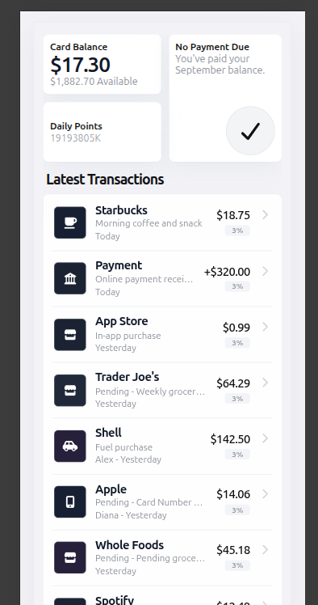
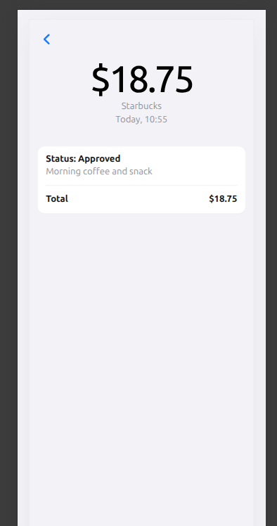

# Wallet App

A small wallet dashboard built with React, TypeScript, and Vite.

The app shows a card summary, daily points, a latest transactions feed, and a transaction details screen. It uses local mock data, client-side routing, and unit tests for the main formatting and points-calculation logic.

## Features

- Wallet overview with current balance and available amount
- Daily points calculation based on registration date and seasonal reset rules
- Transactions list with formatted amounts, dates, and merchant icons
- Transaction details page with status, description, and total
- Unit tests for transaction and points helpers

## Tech Stack

- React 19
- TypeScript
- Vite
- React Router
- Vitest
- Testing Library
- Font Awesome

## Getting Started

### Prerequisites

- Node.js 20+
- npm

### Install dependencies

```bash
npm install
```

### Start the development server

```bash
npm run dev
```

### Build for production

```bash
npm run build
```

### Run tests

```bash
npm run test
```

## Project Structure

```text
src/
  app/                  App entry and router setup
  components/           Reusable UI blocks
  data/                 Typed mock data bindings
  layouts/              Shared page layout
  lib/                  Business logic and formatting helpers
  pages/                Route-level screens
  styles/               Global styles
  types/                Shared TypeScript types
```

## Screenshots

### Transactions List



### Transaction Detail


